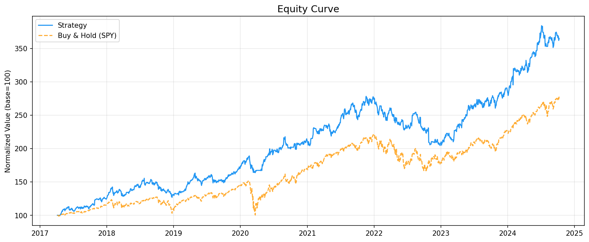
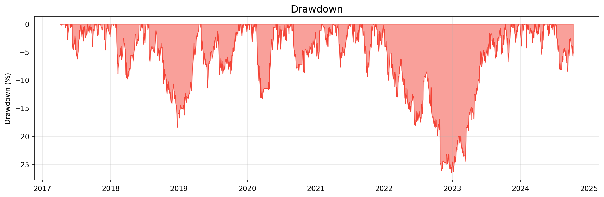
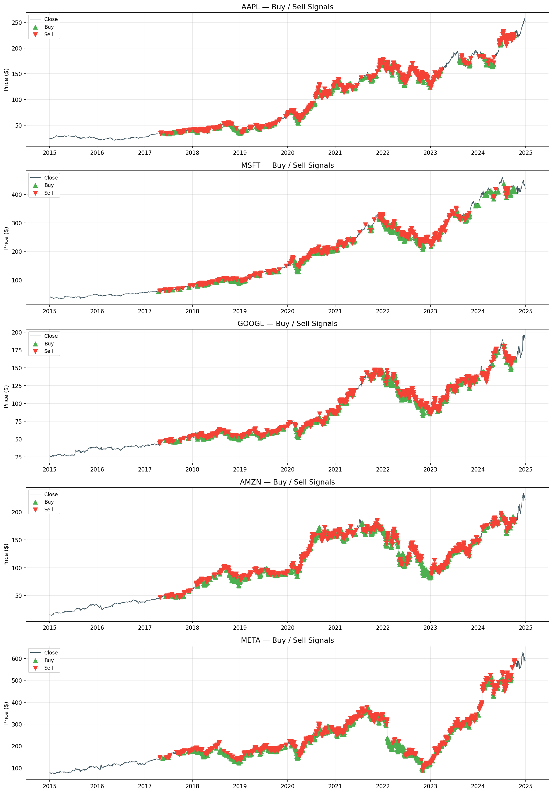
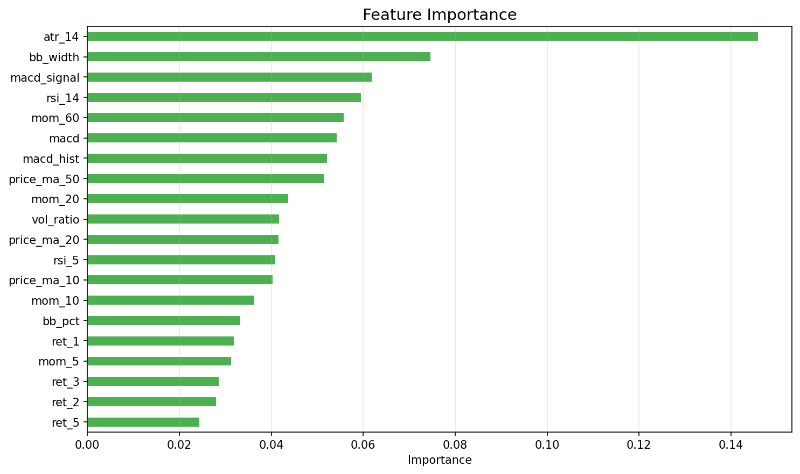
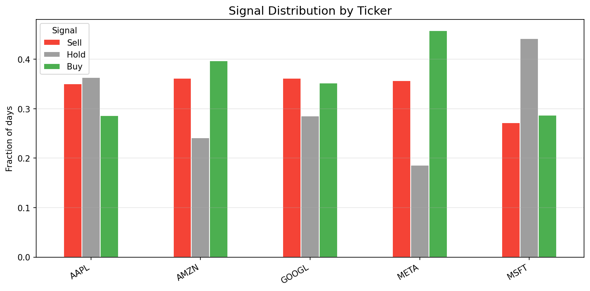
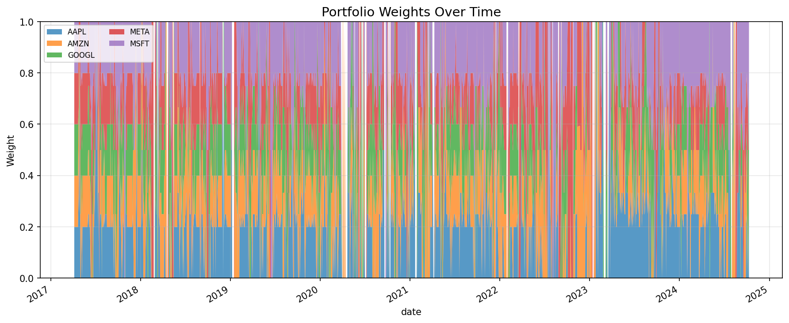
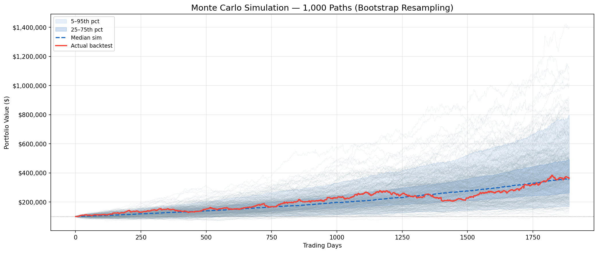
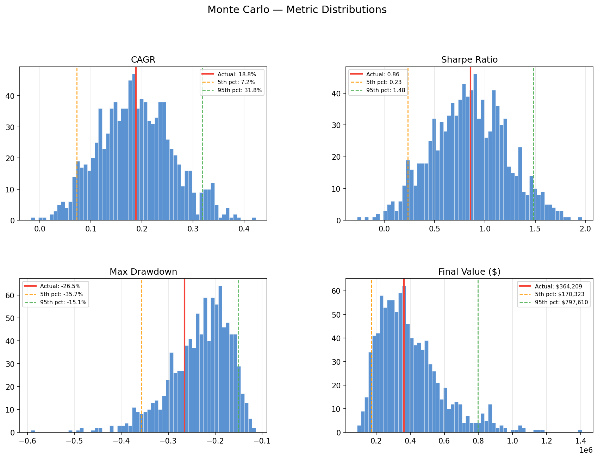

# Random Forest Strategy Learner

An algorithmic trading system built on a Random Forest classifier. Uses technical indicators computed from historical OHLCV data to generate Buy/Hold/Sell signals, allocates capital via a risk parity optimizer with volatility targeting, and validates results through walk-forward cross-validation and Monte Carlo simulation.

Built as an evolution of the Georgia Tech ML4T course project — replacing the scratch implementation with a full, rigorous pipeline using real ML libraries, multi-stock data, and institutional-grade risk management.

---

## How It Works

### 1. Data
Daily OHLCV price data is pulled from Yahoo Finance via `yfinance` and cached locally as Parquet files. Subsequent runs load from cache unless the cache is stale.

### 2. Feature Engineering
Twenty-one technical indicators are computed per ticker per day, using only information available at the close of day `t` — no lookahead:

| Category | Features |
|---|---|
| Momentum | RSI(5), RSI(14), momentum over 5/10/20/60 days, lagged returns |
| Trend | MACD line, signal, histogram (price-normalized) |
| Volatility | Bollinger Band %B, BB width, ATR(14) |
| Volume | Volume ratio vs. 20-day average |
| Price vs. MA | Price relative to MA(10), MA(20), MA(50) |

### 3. Labels
For each day, the 5-day forward return is computed. If it exceeds `+1.5%` the day is labeled **Buy (1)**. If it falls below `-1.5%` the day is labeled **Sell (-1)**. Otherwise **Hold (0)**.

### 4. Walk-Forward Validation
An expanding-window walk-forward splitter ensures the model is always trained on the past and tested on the future — never the reverse:

- Minimum training window: 504 days (~2 years)
- Test window per fold: 63 days (~1 quarter)
- Step size: 63 days
- A 5-day gap separates train end from test start to prevent label leakage

### 5. Random Forest
A single `RandomForestClassifier` is trained on all tickers simultaneously (with a `ticker_id` feature). Key hyperparameters:

```
n_estimators    : 500
max_depth       : 8
min_samples_leaf: 25
max_features    : log2
class_weight    : balanced
```

The model outputs class probabilities (`prob_buy`, `prob_hold`, `prob_sell`) for every ticker on every test day.

### 6. Portfolio Optimization
Risk parity (equal risk contribution) allocates capital across tickers with a Buy signal. Each asset contributes equally to total portfolio variance. Maximum weight per stock: 35%.

### 7. Volatility Targeting
Portfolio weights are scaled down daily when realized volatility exceeds the 15% annual target. This automatically reduces exposure during volatile regimes (crashes, corrections) and restores it during calm markets.

### 8. Backtesting
A vectorized backtester applies weights with a one-day lag (no lookahead), charges 0.1% transaction cost per trade, and rebalances every 5 trading days to limit turnover.

---

## Results

### Strategy vs. Benchmark (SPY Buy & Hold)
Period: January 2015 — December 2024

```
                Strategy    Benchmark
Total Return      264.2%       177.7%
CAGR               18.8%        14.6%
Sharpe Ratio        0.86         0.58
Max Drawdown      -26.5%       -33.7%
Calmar Ratio        0.71         0.43
Win Rate           54.1%        55.5%
Avg Daily Cost    0.0120%         N/A
```

The strategy outperforms SPY on every risk-adjusted metric — higher return, higher Sharpe, and shallower max drawdown.

### Monte Carlo Simulation (1,000 simulations, $100,000 capital)
Bootstrap resampling of daily returns to stress-test whether results depend on lucky ordering of days.

```
Metric           Actual     5th%    Median     95th%
CAGR              18.8%     7.2%     18.5%     31.8%
Sharpe             0.86     0.23      0.85      1.48
Max Drawdown     -26.5%   -35.7%    -22.2%    -15.1%
Final Value     $364,209 $170,323  $358,366  $797,610

Paths beating actual CAGR : 48.5%
Paths with worse drawdown : 26.6%
```

The actual result sits at the median of 1,000 simulated orderings. The edge is robust — not a product of lucky timing.

---

## Plots

### Equity Curve
Strategy (blue) vs. SPY buy-and-hold (orange), normalized to a common base.



### Drawdown
Peak-to-trough drawdown over the full backtest period.



### Buy / Sell Signals
Close price for each ticker with Buy (green triangle up) and Sell (red triangle down) markers from the walk-forward model.



### Feature Importance
Which technical indicators the Random Forest relied on most across all walk-forward folds.



### Signal Distribution
Fraction of Buy/Hold/Sell signals per ticker over the full out-of-sample period.



### Portfolio Weights Over Time
How the risk parity optimizer allocated capital across tickers at each rebalance.



### Monte Carlo Paths
1,000 bootstrap-resampled equity curves. Actual backtest shown in red. Blue bands show the 5th–95th and 25th–75th percentile ranges.



### Monte Carlo Distributions
Histogram of CAGR, Sharpe, Max Drawdown, and Final Value across all simulations. Red line marks the actual backtest result.



---

## Project Structure

```
randomforest_trading_learner/
├── config.py                  # All tunable parameters
├── main.py                    # Main pipeline entry point
├── requirements.txt
├── data/
│   ├── fetcher.py             # yfinance download + Parquet caching
├── features/
│   ├── indicators.py          # Technical indicator computation
│   └── labels.py              # Forward return → Buy/Hold/Sell labels
├── model/
│   ├── walk_forward.py        # Expanding-window time-series CV splitter
│   └── random_forest.py       # RF training, walk-forward orchestration
├── portfolio/
│   └── optimizer.py           # Risk parity + mean-variance optimizer
├── backtest/
│   ├── backtester.py          # Vectorized backtester with vol targeting
│   └── metrics.py             # Sharpe, CAGR, drawdown, Calmar, win rate
├── plots/
│   ├── plotter.py             # All plot functions
│   └── output/                # Saved plot images
└── analysis/
    └── monte_carlo.py         # Bootstrap Monte Carlo simulation
```

---

## Installation

```bash
git clone https://github.com/YOURUSERNAME/randomforest_trading_learner.git
cd randomforest_trading_learner
pip install -r requirements.txt
```

---

## Usage

### Run the main pipeline

```bash
# Default config (tickers and dates from config.py)
python main.py

# Custom tickers and date range
python main.py --tickers AAPL MSFT GOOGL AMZN META --start 2015-01-01 --end 2024-12-31

# Switch optimizer
python main.py --optimizer mean_variance

# Skip saving plots
python main.py --no-plots

# Print fold-level details during walk-forward
python main.py --verbose
```

### Run Monte Carlo simulation

```bash
# Default (1,000 simulations)
python analysis/monte_carlo.py

# Custom simulation count and capital
python analysis/monte_carlo.py --sims 5000 --capital 1000000

# Live animated drawing of paths
python analysis/monte_carlo.py --live

# Fix random seed for reproducible results
python analysis/monte_carlo.py --seed 42
```

---

## Configuration

All parameters are in `config.py`. Key ones to experiment with:

| Parameter | Default | Effect |
|---|---|---|
| `TICKERS` | 5 tech stocks | Universe of stocks to trade |
| `FORWARD_HORIZON` | 5 | Days ahead for label generation |
| `BUY_THRESHOLD` | 0.015 | Minimum forward return to label as Buy |
| `SELL_THRESHOLD` | -0.015 | Maximum forward return to label as Sell |
| `OPTIMIZER` | risk_parity | `"risk_parity"` or `"mean_variance"` |
| `REBALANCE_FREQ` | 5 | Rebalance every N trading days |
| `VOL_TARGET` | 0.15 | Target annualized portfolio volatility |
| `MAX_WEIGHT` | 0.35 | Maximum allocation to any single stock |
| `RF_PARAMS` | see config | Random Forest hyperparameters |

---

## Dependencies

```
yfinance>=0.2.40
scikit-learn>=1.4
pandas>=2.0
numpy>=1.26
scipy>=1.12
matplotlib>=3.8
pyarrow>=15.0
```
